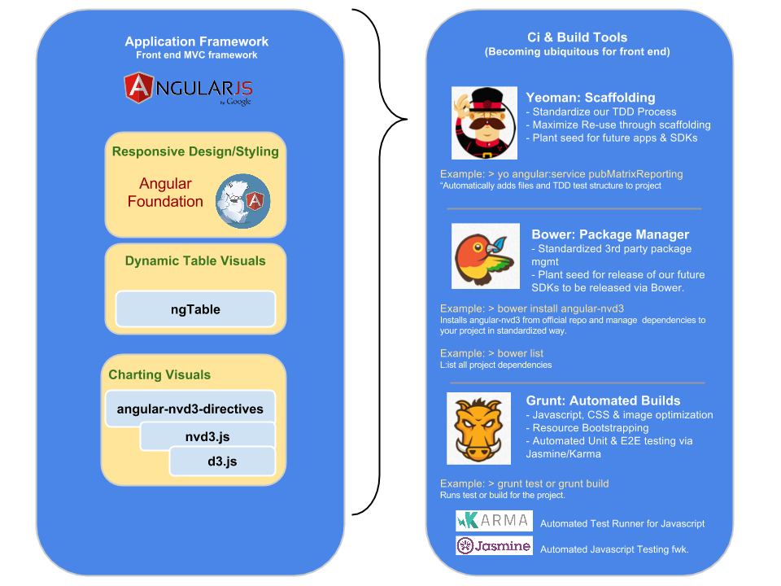

PubMatic Kickstart UI
=========
Follow 7 steps below to build a PubMatic Kickstart UI environment.

<h1>Environment Setup: </h1>
Assumes <a href="http://nodejs.org/">node.js</a> is installed on your machine 
<code>
 > git clone https://github.com/PubMatic/kickstart.git
</code> - Known issue.  Perform work around for issue below
 
<code>
 > cd kickstart
</code> 
<code>
 > sh run.sh
</code>
  Your local testing environment will open in a browser window at http://localhost:9000

<code><b>Known Issue:</b>  
A fix is in progress. Until then SSH keys must be set up manually for your user in order for the build to work.  The symptom of this issue is a "tophat" library error during the "run.sh" process.  This step should be completed before running "run.sh" script. </code>
  
https://help.github.com/articles/generating-ssh-keys

<h1>Environment Shutdown: </h1>
If your environment is up and running in "grunt serve", stop it by killing "grunt" and "node" processes. 

<h1>Issues </h1>
Many have encountered an error running "grunt serve" (Run with --force option).  We have put in a fix for this issue but if you still encounter it, please do not use the --force option.  This is a build problem.  Instead let us know on <a href="https://github.com/PubMatic/kickstart/issues/6">here</a>

<h1>How it's Built</h1>
Components of the Kickstart UI development environment:  
</img>

<h1>Starting your local environment</h1>
Builds are managed using <a href='http://gruntjs.com/'>Grunt build tool</a>. To use grunt, navigate to root kickstart folder and use any of these commands:
(If you are simply trying to run the environment locally, use 'grunt serve')
<table>
<tr><td>grunt shell</td>   <td>  Run first time only.  Installs necessary dependencies (Ruby Gems etc.)    </td></tr>
<tr><td>grunt serve</td>   <td>  Start Your environment in debug mode at url: http://localhost:900    </td></tr>
<tr><td>grunt jshint</td>  <td>  Check your code style against PubMatic coding standards</td></tr>
<tr><td>grunt test</td>    <td>  Verify your application is ready to deploy.  Run the automated unit testing suite.</td></tr>
<tr><td>grunt ngdocs</td>    <td>  Auto Generate documentation for PubMatic Web Components.</td></tr>
<tr><td> grunt </td> <td>  Production build deployed to "dist" folder.  "dist" is deployed via CI/Jenkins.  </td></tr>
</table>

<!--Style guide located <a href='https://inside.pubmatic.com:8443/confluence/display/Products/Javascript+and+AngularJS+Coding+Standards'>on wiki</a>.  -->

<h1>Design and Styling</h1>
Coming Soon! Kickstart UI will use a PubMatic designed UX Component library called <a href="https://github.com/PubMatic/tophat">TopHat</a> (installed via bower)

